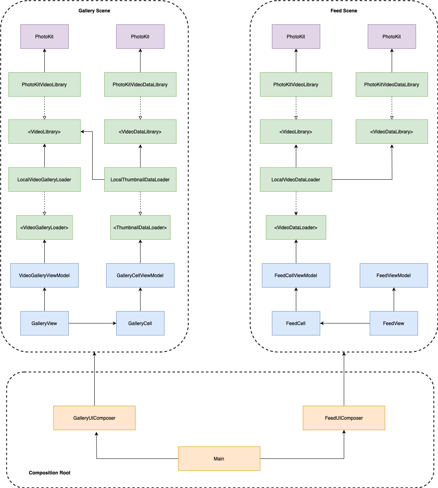

# CameraTok

## Instructions
1. Clone the repository
2. Open the file /CameraTokApp/CameraTokApp.xcworkspace
3. Select CameraTokApp scheme and run on simulator or device

---

## Thinking process
- The idea was to create different modules to isolate each component;
- The UI should not depend on any external modules, and to achieve this I've created a presentation layer (ViewModels) to depend on abstractions of the domain layer;
- I started with the domain and I wrote some unit tests to cover this part of the code;
- After this I created the infrastructure using the Photos (PhotoKit) framework;
- Then I created the App project, the idea was to have only code related to UI in this project, and also the composition of the UI dependencies;
- The UI was made with SwiftUI framework, but there is a few codes of UIKit used to build the VideoPlayer;
- The VideoPlayer on SwiftUI doesn't have almost any customization support, that's why I had to use UIKit;
- The main dificulties of this project was to build the FeedView, it's a lazy vertical list and each cell has a player that fits the entire screen;
- The app still have some issues with the video sounds;

---

## App Architecture

